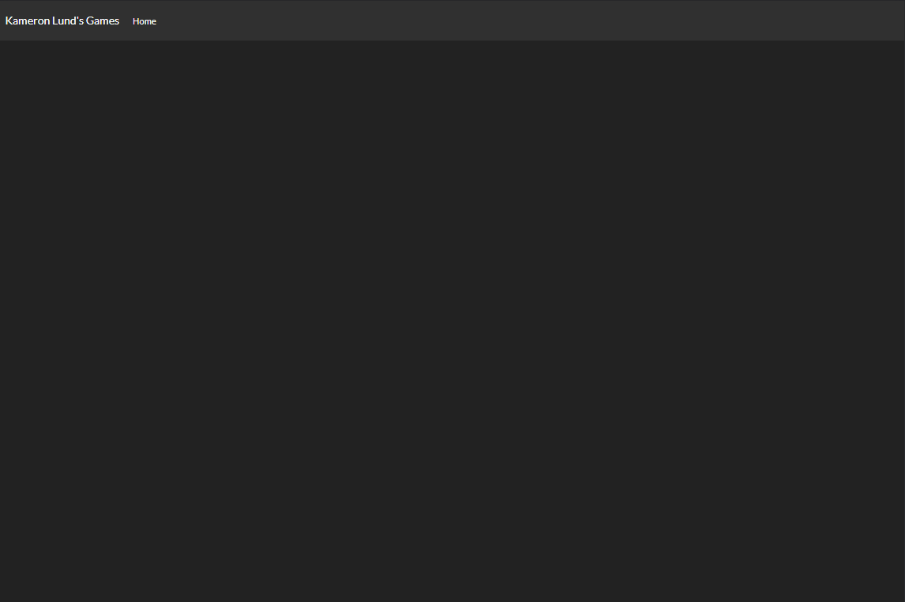
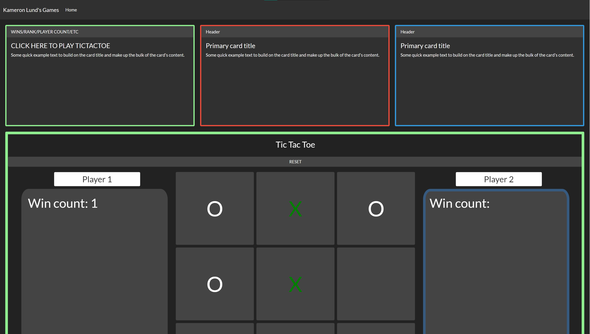

# Vanilla JavaScript/Bootstrap Playground

*(Open homePage/home.html in Chrome to view project)*

## **Objective**

- Create a home page to display links to simple HTML/JavaScript games using Bootstrap elements + themes.
- Demonstrate use of event listeners on home page by creating a dynamic layout.      
- Demonstrate use of event listeners in games to create dynamic/clickable inputs. 
- Make homepage layout consistent and tileable. 
- Use classes to give elements dynamic CSS properties. 
- Keep track of progress in MD format :)

## **Step One: Creating Home Page and Nav Bar**
Nav bar was made by adding the bootstrap.min.css file to the home.html's stylesheets (using <link rel="stylesheet" href="bootstrap.min.css"\>).

Nav bar  style found on https://bootswatch.com/darkly/ with most of the menu options striped for the purposes of this project

**Reflection:** This was an easy step, but it did allow for me to experiment with colors, themes, and bootstrap classes.

## **Step Two: Creating Tic-Tac-Toe Page && Linking Home and Tic-Tac-Toe Pages**
Created tic-tac-toe.html and copied all of the basic assets from the home page over -- acting as a consistent template.

Added the html sections to create nested layout: body -> title -> main view -> playspace -> playerOne, ticTacToe board, playerTwo ; where main view is a section of body and main view contains playspace.

Used grouped elements with flex boxes to get desired layout. (3 vertical flex boxes and two horizontal). Flex grid used to create a space to house 9 equal-sized buttons representing the Tic Tac Toe play space.

Added reset button and 9 buttons representing the Tic Tac Toe squares.

Added text and created forms for name inputs inside each player section. Text displays 'Win count: ' with no accompanying number. Player sections also got two CSS styles. One representing the active player where there is a border outline and one representing a player waiting for their turn. Similarly -- Tic Tac Toe squares got styles corresponding to whether or not they were empty.

Linked home.html to the anchor labelled home in the nav bar. Home screen still does not lead to Tic Tac Toe.

**Reflection:** This step took the most planning. Size proportions of Player One box, Tic Tac Toe grid, and Player Two box went through over ten iterations before I felt satisfied with the layout. Overall, great for understanding flex boxes and how height / width is inherited.

## **Step Three: Tic Tac Toe Logic**
Started by creating the tic-tac-toe.js file. First priority was setting each button up with an event listener set to "click". Once a click was initiated the button's inner text was changed to be an X.

After a click event happens a function to switch players is triggered. In when players are switched, a variable called current player switches between carrying a 'X' or an 'O'.

Next the logic to store button innerText values in an array was created inside of the markButton function used in step-one. Once the button's values could be stored, a function to check whether 3 buttons in a row were all all x or all o was created.

Array format =>

[A1 Value, A2 Value, A3 Value,

 B1 Value, B2 Value, B3 Value,

 C1 Value, C2 Value, C3 Value]

Reset button was finally implemented to clear all button values and start with playerOne all over again. This time a score count increases corresponding to whoever won the round.

**Reflection:** This was the most technical part of the project. It took quite a bit of manual testing to figure out the logic. This is where I first got in the habit of breaking my JavaScript functions into their most basic forms -- this made fixes 10x easier to implement.

## **Step Four: Creating Game Preview and Hover Logic**
Started by separating the homePage into a 3 wide grid. Initial play was to have the first row dedicated to 3 separate card representing 3 different games (2 placeholders in this case). Rows 2 was set aside for a single game preview that would change based on which game card you hovered on.

Home page format=>

Game Card, Game Card, Game Card, 

------------Game Preview------------

THe next step was to set up a preview card style corresponding to each game card. The preview card adopts the game cards color and displays a screenshot of the game.

Mouse Enter event listener added in the home.js to keep track of which card was most recently hovered on. The preview card would take this as a cue to adopt the hovered on card's style.

Click logic was added to both the game card and preview card to take you to the corresponding game (only tic-tac-toe as of yet).

**Reflection:** This was the most creative stage of the process and it allowed me to get very familiar with changing the preview-cards attributes dynamically. UX was the main focus of the JavaScript, which allowed me to play around and find what dynamic actions felt best.

